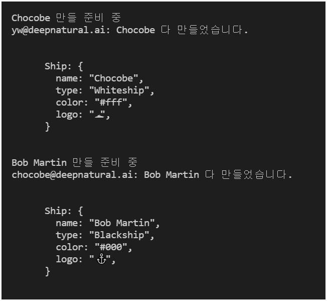

# 01_02 ``FactoryMethod`` 패턴

Instance 를 생성할 때, 생성자에서 분기문을 통해 Instance의 특징을 부여하는 경우, 유용하게 사용할 수 있습니다.

``FactoryMethod`` 패턴의 특징은 다음과 같습니다.

* 생성자 내부의 분기물을 추상화 메서드 호출로 사용합니다. (자식 class에서 구현한 메서드)
* 공통 생성자 로직은 ``FactoryMethod`` 패턴의 ``부모 class`` 에서 작성 합니다.


<br/>


## ``장점``

* Instance의 생성자에 분기문을 사용할 경우, 특성이 추가될 때마다 분기문이 추가되지만, ``FactoryMethod`` 패턴은 구체화한 ``Factory class``를 작성하는 방식 입니다.
* Instance의 특성마다 ``개별 class``로 구현했기 때문에, ``개방 폐쇄 원칙 (OCP: Open closed Principle)`` 을 준수하게 됩니다.


<br/>


## ``단점``

* Product Instance 종류만큼의 class 가 필요합니다.


<br/>

아래의 코드는 ``FactoryMethod`` 패턴을 Javascript 로 구현한 결과 입니다.

예제의 시나리오는 다음과 같습니다.

* class Ship
* class ShipFactory
  * class WhiteshipFactory extends ShipFactory (흰색 타입의 Ship 객체 생성용  Factory)

<br/>

```javascript
// Ship.js
export default class Ship {
  /** @type { string } */
  #name

  /** @type { string } */
  #type

  /** @type { string } */
  #color

  /** @type { string } */
  #logo
  
  /**
   * @param { string } name
   * @param { string } type
   * @param { string } color
   * @param { string } logo
   */
  constructor(name, type, color, logo) {
    this.#name = name;
    this.#type = type;
    this.#color = color;
    this.#logo = logo;
  }

  /** @returns { string } */
  get name() {
    return this.#name;
  }

  print() {
    console.log(`
      Ship {
        name: ${this.#name},
        type: ${this.#type},
        color: ${this.#color},
        logo: ${this.#logo}
      }
    `);
  }
}
```

<br/>

```javascript
// ShipFactory.js
// Ship Instance 생성용 추상화 Factory class

/** @typedef { import("./Ship.js").default } Ship */

export default class ShipFactory {
  /** @returns { Ship } */
  orderShip(name, email) {
    this.#isValid(name, email);
    this.#prepareFor(name);

    /** @type { Ship } */
    const ship = this._createShip(name);
    this.#sendEmailTo(email, ship);

    return ship;
  }

  #isValid(name, email) {
    if(!name || !name.length) {
      throw new Error("배 이름을 지어주세요");
    }

    if(!email || !email.length) {
      throw new Error("연락처를 남겨주세요");
    }
  }

  #prepareFor(name) {
    console.log(`\n${name} 만들 준비 중`);
  }

  #sendEmailTo(email, ship) {
    console.log(`${email}: ${ship.name} 다 만들었습니다.\n`);
  }

  // 추상 메서드
  // 구체화 Factory class 에서 Override 하지 않았다면, Error를 발생 시킵니다. (abstract method를 흉내내어 보았습니다.)
  _createShip() {
    throw new Error("_createShip() 메서드 @Override가 필요 합니다.");
  }
}
```

<br/>

```javascript
// WhiteshipFactory.js
// 흰색 타입 Ship을 위한 구체화 Factory 입니다.

import ShipFactory from "./ShipFactory.js";
import Ship from "./Ship.js";

export default class WhiteshipFactory extends ShipFactory {
  constructor() {
    super();
  }

  /**
   * @override
   * @param { string } name
   * @returns { Ship }
   */
  _createShip(name) {
    return new Ship(name, "Whiteship", "#fff", "\uD83D\uDEE5");
  }
}
```

<br/>

```javascript
// App.js
// 메인 파일

import WhiteshipFactory from "./WhiteshipFactory.js";

const whiteshipFactory = new WhiteshipFactory();
const whiteship = whiteshipFactory.orderShip("Chocobe", "yw@deepnatural.ai");

whiteship.print();
```


<br/><br/>


## 기존의 ``흰색 타입`` Ship 에 영향없이, ``검정 타입`` Ship 을 확장하기

추가할 class는 다음과 같습니다.

* class BlackshipFactory extends ShipFactory (검정 타입의 Ship 객체 생성용  Factory)

<br/>

```javascript
import ShipFactory from "./ShipFactory.js";

export default class BlackshipFactory extends ShipFactory {
  constructor() {
    super();
  }

  /** 
   * @override
   * @param { string } name
   * @returns { Ship }
   */
  _createShip(name) {
    return new Ship(name, "Blackship", "#000", "⚓");
  }
}
```

<br/>

위와 같이 추가한 ``BlackshipFactory.js`` 를 사용하여, ``검정 타입 Ship`` 을 만들어 보겠습니다.

```javascript
// App.js 에 추가
// 메인

import WhiteshipFactory from "./WhiteshipFactory.js";
import BlackshipFactory from "./BlackshipFactory.js";

const whiteshipFactory = new WhiteshipFactory();
const whiteship = whiteshipFactory.orderShip("Chocobe", "yw@deepnatural.ai");

whiteship.print();

const blackshipFactory = new BlackshipFactory();
const blackship = blackshipFactory("Bob Martin", "chocobe@deepnatural.ai");

blackship.print();
```

<br/>

기존의 Whiteship 이나 ShipFactory 에 아무런 영향을 주지 않으면서, ``Blackship``이라는 ``구체화 Instance`` 를 만들 수 있게 되었습니다.




<br/>

<hr/><br/>


[ [🚀 최상단으로 이동](https://github.com/Chocobe/-Study-DesignPatter) ]

[ [🐫 ``CreationalPattern`` 으로 이동](https://github.com/Chocobe/-Study-DesignPatter/tree/master/src/_01_CreationalPattern) ]
